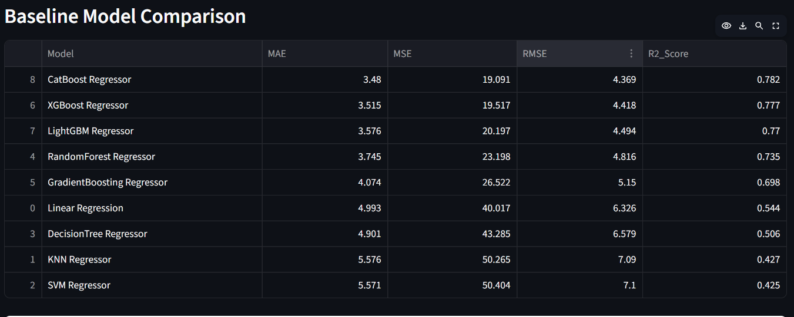
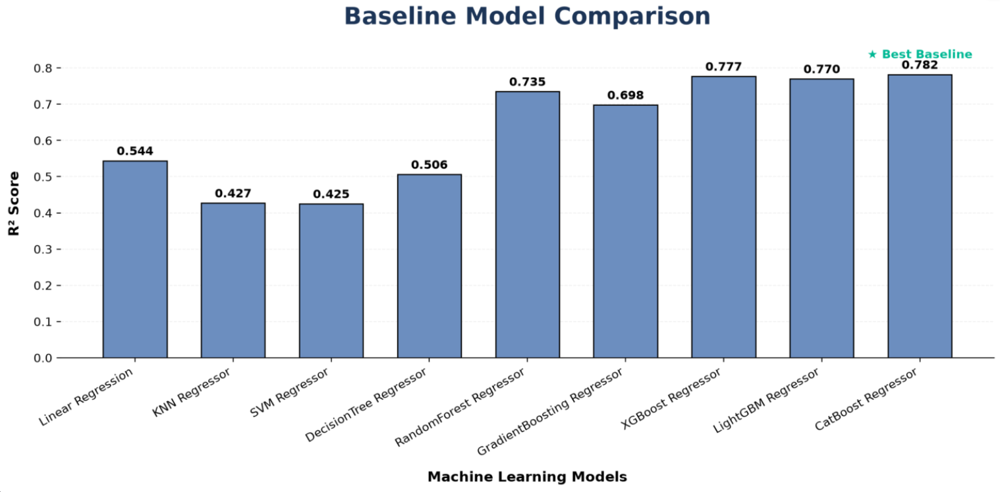
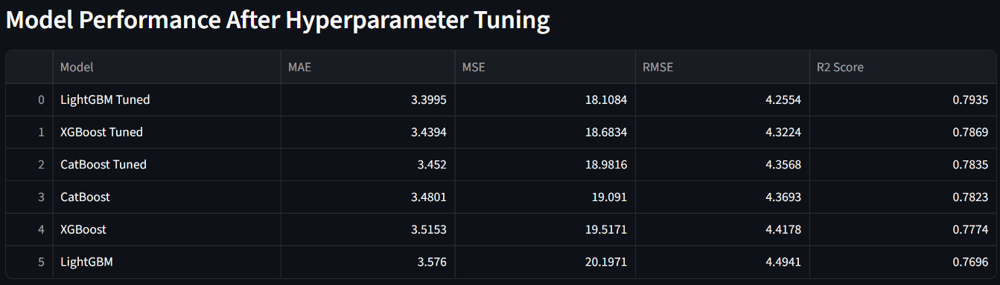
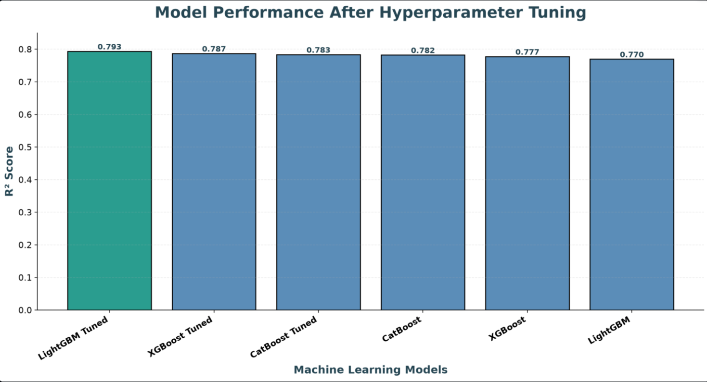
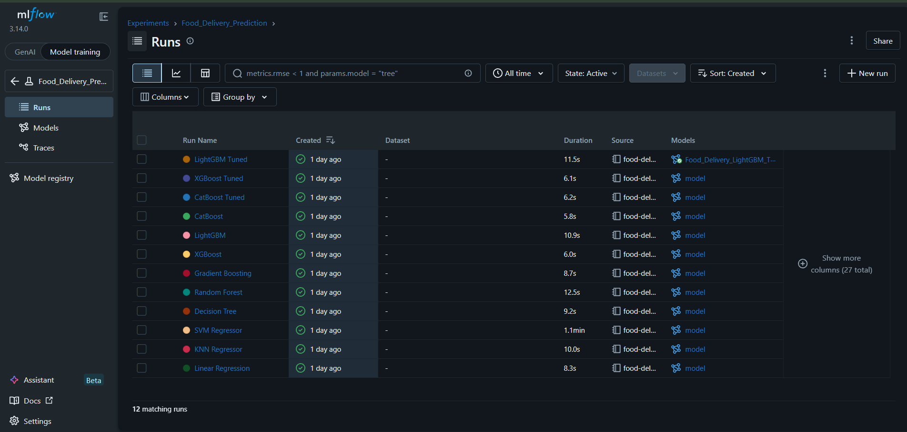
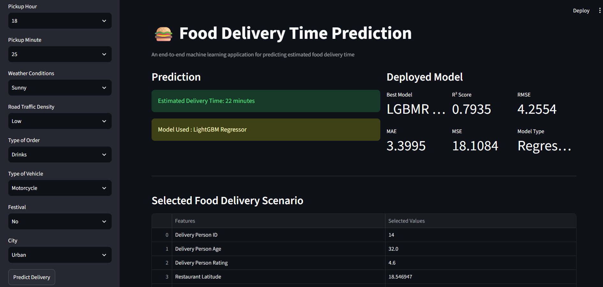
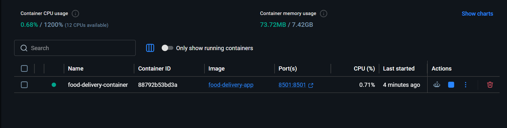

# 🍔 Food Delivery Time Prediction

### End-to-End Machine Learning Regression Project

A production-oriented Machine Learning project that predicts **food delivery time in minutes** using delivery-partner details, location, weather, traffic, vehicle condition, order information, and time-based features.

<p align="center">


</p>

<p align="center">

**45,593 Records  •  Regression  •  9 Models Compared  •  Tuned LightGBM  •  MLflow  •  Docker  •  Streamlit**

</p>

---

## Live Demo

<p align="center">

### [Open the Food Delivery Time Prediction App](https://akhlaque03-food-delivery-time-prediction.streamlit.app/)

</p>

The deployed application allows users to enter delivery, location, traffic, weather, vehicle, order, and timing information and receive an estimated delivery time.

---

## Project Preview

<p align="center">


</p>

---

## Project Overview

Food delivery time depends on multiple factors such as:

* Delivery-partner characteristics
* Restaurant and customer locations
* Weather conditions
* Road traffic
* Vehicle condition
* Order type
* Multiple deliveries
* Festival status
* City
* Order and pickup timing

The objective of this project is to build a regression model capable of estimating the expected delivery time in minutes and deploy it as an interactive web application.

## 🔄 Machine Learning Workflow

The project follows a structured end-to-end Machine Learning workflow covering data preparation, model development, experiment tracking, optimization, and deployment.

The major stages are:

**Data Preparation → Feature Engineering → Model Development → Experiment Tracking → Hyperparameter Tuning → Model Selection → Model Persistence → Application Development → Containerization → Cloud Deployment**

---


---

## 💼 Business Problem

Food delivery time is influenced by multiple real-world factors such as traffic, weather, delivery-partner characteristics, vehicle condition, location, order details, and order timing.

For a food-delivery platform, inaccurate delivery estimates can affect customer satisfaction and operational planning.

This project addresses the problem as a **supervised regression task** to estimate delivery time in minutes from historical order data.

### Business Value

* Improve estimated delivery-time accuracy
* Enhance customer experience
* Support delivery-partner allocation
* Improve operational planning
* Assist restaurant and logistics coordination

---


---

## 📊 Dataset

The project uses a real-world food-delivery dataset containing **45,593 delivery records** with a combination of numerical, categorical, geographical, weather, traffic, vehicle, and time-related features.

###  Prediction Target

| Target Variable   | Description                         |
| ----------------- | ----------------------------------- |
| `Time_taken(min)` | Total food delivery time in minutes |

### 📦 Feature Categories

| Category            | Examples                                   |
| ------------------- | ------------------------------------------ |
|  Delivery Partner | Age, ratings, delivery-partner ID          |
|  Location         | Restaurant and customer latitude/longitude |
|  Environment     | Weather conditions, traffic density        |
|  Vehicle          | Vehicle type, vehicle condition            |
|  Order            | Order type, multiple deliveries            |
|  Context          | Festival status, city                      |
|  Time              | Order date, order time, pickup time        |

###  Main Features

| Feature                       | Description                  |
| ----------------------------- | ---------------------------- |
| `Delivery_person_ID`          | Delivery partner identifier  |
| `Delivery_person_Age`         | Delivery partner age         |
| `Delivery_person_Ratings`     | Delivery partner rating      |
| `Restaurant_latitude`         | Restaurant latitude          |
| `Restaurant_longitude`        | Restaurant longitude         |
| `Delivery_location_latitude`  | Customer latitude            |
| `Delivery_location_longitude` | Customer longitude           |
| `Order_Date`                  | Order date                   |
| `Time_Orderd`                 | Order placement time         |
| `Time_Order_picked`           | Order pickup time            |
| `Weatherconditions`           | Weather condition            |
| `Road_traffic_density`        | Traffic density              |
| `Vehicle_condition`           | Vehicle condition            |
| `Type_of_order`               | Food order type              |
| `Type_of_vehicle`             | Delivery vehicle type        |
| `multiple_deliveries`         | Number of deliveries handled |
| `Festival`                    | Festival indicator           |
| `City`                        | Delivery city                |

---


##  Data Cleaning & Preprocessing

The raw dataset contained missing values, inconsistent entries, mixed data types, and extreme numerical observations. A structured preprocessing pipeline was applied before model training.

### Data Cleaning

* Removed unnecessary ID columns.
* Replaced invalid string values such as `NaN ` with actual missing values.
* Converted numerical columns to appropriate numeric data types.
* Converted `Order_Date` into datetime format.
* Converted order and pickup time fields into usable time-based features.
* Removed original date and time columns after feature extraction.

### Missing Value Treatment

| Feature Type         | Treatment         |
| -------------------- | ----------------- |
| Numerical Features   | Median Imputation |
| Categorical Features | Mode Imputation   |

### Outlier Treatment

**IQR-based clipping** was applied to selected numerical features to reduce the influence of extreme observations while retaining the original records.

### Encoding Strategy

| Technique          | Applied To                                                 |
| ------------------ | ---------------------------------------------------------- |
| Frequency Encoding | `Delivery_person_ID`                                       |
| One-Hot Encoding   | Weather, traffic, order type, vehicle type, festival, city |
| Feature Scaling    | Numerical features                                         |

### Train-Test Preparation

The processed dataset was split into training and testing sets before model development to evaluate model performance on unseen data.

The same preprocessing structure is preserved through saved artifacts so that user inputs can be transformed consistently during model inference.

---


## ⚙️ Feature Engineering

Feature engineering was performed to transform raw date, time, and categorical information into meaningful features that could help the regression models learn delivery-time patterns.

###  Date Features

The `Order_Date` column was transformed into:

* `Order_Day`
* `Order_Month`
* `Order_Day_of_Week`

###  Time Features

Order and pickup times were transformed into:

* `Order_Hour`
* `Order_Minute`
* `Pickup_Hour`
* `Pickup_Minute`


###  Feature Scaling

Numerical features were scaled after encoding to ensure that features were represented on comparable scales, particularly for algorithms sensitive to feature magnitude.

###  Feature Engineering Goal

The engineered features provide the models with additional information about:

* Delivery-partner characteristics
* Geographic information
* Traffic and environmental conditions
* Order timing
* Pickup timing
* Delivery context

This transformation helps convert raw operational data into model-ready features for delivery-time prediction.

---


##  Model Development

Multiple regression algorithms were trained and evaluated to identify the most effective approach for predicting food delivery time.

### Baseline Models

The following **9 regression algorithms** were trained and compared:

1. Linear Regression
2. KNN Regressor
3. SVM Regressor
4. Decision Tree Regressor
5. Random Forest Regressor
6. Gradient Boosting Regressor
7. XGBoost Regressor
8. LightGBM Regressor
9. CatBoost Regressor

### Evaluation Metrics

Each model was evaluated using four regression metrics:

* **R² Score** — Measures the proportion of variance explained by the model.
* **MAE** — Measures the average absolute prediction error in minutes.
* **MSE** — Measures the average squared prediction error.
* **RMSE** — Measures prediction error in the same unit as the target variable.

### Model Selection Strategy

The model development process followed a two-stage approach:

**Stage 1 — Baseline Comparison**

All 9 models were trained using the prepared dataset and evaluated using the same metrics.

**Stage 2 — Hyperparameter Optimization**

The strongest boosting models from the baseline comparison were selected for further tuning:

* XGBoost
* LightGBM
* CatBoost

The tuned models were then compared against their baseline versions to identify the final deployment model.

---


##  Baseline Model Performance

Before hyperparameter tuning, all nine regression models were evaluated using the same train-test split and evaluation metrics.

| Model             |        MAE |         MSE |       RMSE |   R² Score |
| ----------------- | ---------: | ----------: | ---------: | ---------: |
| **CatBoost**      | **3.4801** | **19.0910** | **4.3693** | **0.7823** |
| XGBoost           |     3.5153 |     19.5171 |     4.4178 |     0.7774 |
| LightGBM          |     3.5760 |     20.1971 |     4.4941 |     0.7696 |
| Random Forest     |     3.7452 |     23.1980 |     4.8164 |     0.7354 |
| Gradient Boosting |     4.0741 |     26.5216 |     5.1499 |     0.6975 |
| Decision Tree     |     4.9011 |     43.2849 |     6.5791 |     0.5063 |
| KNN Regressor     |     7.8676 |     95.0377 |     9.7487 |    -0.0839 |
| SVM Regressor     |     8.1408 |     95.7741 |     9.7864 |    -0.0923 |
| Linear Regression |    65.3959 |   4426.1270 |    66.5291 |   -49.4815 |

###  Baseline Result

**CatBoost achieved the strongest baseline performance** with:

* **R² Score:** 0.7823
* **MAE:** 3.4801 minutes
* **RMSE:** 4.3693 minutes

Based on the baseline results, **CatBoost, XGBoost, and LightGBM** were selected as the strongest candidates for hyperparameter tuning.

###  Baseline Model Comparison

<p align="center">



</p>

### 📈 Baseline Model Performance

<p align="center">



</p>


---

##  Hyperparameter Tuning

After the baseline comparison, **CatBoost, XGBoost, and LightGBM** were selected for further optimization.

`RandomizedSearchCV` with **5-fold cross-validation** was used to explore different hyperparameter combinations and identify configurations with improved validation performance.

### Models Tuned

* **LightGBM**
* **XGBoost**
* **CatBoost**

### LightGBM Search Space

The LightGBM search included important parameters controlling model complexity, learning behavior, sampling, and regularization:

```text
n_estimators
learning_rate
max_depth
num_leaves
min_child_samples
subsample
colsample_bytree
reg_alpha
reg_lambda
```

### Final Tuned LightGBM Configuration

The selected LightGBM configuration was:

```python
LGBMRegressor(
    subsample=0.7,
    reg_lambda=5,
    reg_alpha=0.01,
    num_leaves=100,
    n_estimators=500,
    min_child_samples=30,
    max_depth=-1,
    learning_rate=0.05,
    colsample_bytree=0.7,
    random_state=42
)
```

The optimized models were evaluated using **R² Score, MAE, MSE, and RMSE** and compared with their baseline versions.

---


##  Tuned Model Comparison

After hyperparameter tuning, the three optimized boosting models were compared with their baseline versions using the same evaluation metrics.

| Model              |        MAE |         MSE |       RMSE |   R² Score |
| ------------------ | ---------: | ----------: | ---------: | ---------: |
| **LightGBM Tuned** | **3.3995** | **18.1084** | **4.2554** | **0.7935** |
| XGBoost Tuned      |     3.4394 |     18.6834 |     4.3224 |     0.7869 |
| CatBoost Tuned     |     3.4520 |     18.9816 |     4.3568 |     0.7835 |
| CatBoost           |     3.4801 |     19.0910 |     4.3693 |     0.7823 |
| XGBoost            |     3.5153 |     19.5171 |     4.4178 |     0.7774 |
| LightGBM           |     3.5760 |     20.1971 |     4.4941 |     0.7696 |

###  Tuned Model Comparison

<p align="center">



</p>

### Tuned Model Performance

<p align="center">



</p>

### Final Tuning Result

**LightGBM Tuned achieved the best overall performance** among the tuned candidates:

* **R² Score:** 0.7935
* **MAE:** 3.3995 minutes
* **RMSE:** 4.2554 minutes
* **MSE:** 18.1084

It outperformed **XGBoost Tuned (R² 0.7869)** and **CatBoost Tuned (R² 0.7835)**.

Therefore, **LightGBM Tuned was selected as the final deployment model.**


---

##  Final Model

### LightGBM Tuned

**Tuned LightGBM** was selected as the final deployment model after comparing the tuned XGBoost, LightGBM, and CatBoost models.

### Final Performance

| Metric       |              Score |
| ------------ | -----------------: |
| **R² Score** |         **0.7935** |
| **MAE**      | **3.3995 minutes** |
| **RMSE**     | **4.2554 minutes** |
| **MSE**      |        **18.1084** |

The final model explains approximately **79.35% of the variance** in delivery time on the evaluation data, with an average absolute prediction error of approximately **3.40 minutes**.


###  Final Model Metrics

<p align="center">


</p>

The final tuned LightGBM model achieved the strongest overall performance among the tuned candidates and was selected for deployment in the Streamlit application.


---

##  Feature Importance Analysis

To understand which factors contributed most to delivery-time prediction, feature importance analysis was performed using the final **LightGBM Tuned** model.

The analysis helps identify the operational factors that have the strongest influence on delivery-time estimation.

### Top Important Features

| Feature                       | Importance |
| ----------------------------- | ---------: |
| `Order_Day`                   |       4617 |
| `Delivery_location_latitude`  |       3844 |
| `Delivery_person_ID`          |       3652 |
| `Delivery_location_longitude` |       3387 |
| `Restaurant_longitude`        |       3381 |
| `Delivery_person_Age`         |       3375 |
| `Restaurant_latitude`         |       3258 |
| `Order_Hour`                  |       2954 |
| `Delivery_person_Ratings`     |       2515 |
| `Pickup_Hour`                 |       2362 |

### Key Observations

The feature importance results show that delivery time is mainly influenced by:

*  **Geographical factors** — restaurant and customer locations
*  **Time-related patterns** — order and pickup timing
*  **Delivery-partner information** — age, ratings, and delivery history

These insights demonstrate that delivery-time prediction depends on a combination of operational, geographical, and temporal factors.


---

## 📊 MLflow Experiment Tracking

MLflow was integrated into the project to track, compare, and manage Machine Learning experiments throughout the model development lifecycle.

It provided a structured way to record model experiments, evaluation results, and final model performance.

### Tracked Information

* Model parameters
* Model runs
* Evaluation metrics
* Baseline model experiments
* Hyperparameter tuning experiments
* Final model performance

### MLflow Experiment Name

```text
Food_Delivery_Prediction
```

### MLflow Tracking Dashboard

<p align="center">



</p>

MLflow improved experiment reproducibility by maintaining a complete history of model training, comparison, and evaluation results.

---

##  Model Artifacts

The trained model and preprocessing components are saved separately to ensure that the same transformations used during training can be reproduced during prediction.

| Artifact                           | Purpose                                                      |
| ---------------------------------- | ------------------------------------------------------------ |
| `Food_Delivery_LightGBM_Tuned.pkl` | Final tuned LightGBM regression model                        |
| `feature_columns.pkl`              | Stores the feature-column order required during inference    |
| `freq_mappings.pkl`                | Stores frequency-encoding mappings used during preprocessing |

These artifacts are loaded by the Streamlit application to:

* Prepare user inputs in the same format as training data
* Apply consistent preprocessing transformations
* Generate delivery-time predictions using the trained LightGBM model

This approach ensures reliable and reproducible model inference after deployment.


---

##  Streamlit Application

The final **LightGBM Tuned** model was integrated into an interactive Streamlit web application for real-time delivery-time prediction.

The application allows users to provide delivery-related information and generates an estimated food delivery time in minutes using the trained Machine Learning model.

### Application Features

*  Delivery-partner information
*  Restaurant and customer location details
*  Weather conditions
*  Road traffic density
*  Vehicle condition and vehicle type
*  Order-related information
*  Festival and city details
*  Order and pickup timing
*  Real-time delivery-time prediction

###  Application Interface

<p align="center">


</p>

###  Prediction Result

<p align="center">



</p>

###  Live Application

<p align="center">

<a href="https://akhlaque03-food-delivery-time-prediction.streamlit.app/">
Open Food Delivery Time Prediction App
</a>

</p>

The deployed application demonstrates the complete journey from model development to a user-facing Machine Learning solution.

---


##  Docker Deployment

The Streamlit application was containerized using Docker to create a consistent and reproducible deployment environment.

Docker packages the application code, dependencies, and runtime configuration together, making the application easier to run across different environments.

### Docker Configuration

The project includes:

```text
Dockerfile
```

### Build Docker Image

```bash
docker build -t food-delivery-app .
```

### Run Docker Container

```bash
docker run -p 8501:8501 food-delivery-app
```

After starting the container, the Streamlit application can be accessed locally:

```text
http://localhost:8501
```

### Docker Container Running

<p align="center">



</p>

Docker deployment ensures that the Machine Learning application can be executed in a stable and reproducible environment.

---


##  Local Setup & Installation

Follow these steps to run the Food Delivery Time Prediction application locally.

### 1. Clone Repository

```bash
git clone https://github.com/Akhlaque03/Food-Delivery-Time-Prediction.git
cd Food-Delivery-Time-Prediction
```

### 2. Create Virtual Environment

```bash
python -m venv venv
```

### 3. Activate Environment — Windows

```bash
venv\Scripts\activate
```

### 4. Install Dependencies

```bash
pip install -r requirements.txt
```

### 5. Run Streamlit Application

```bash
streamlit run app.py
```

The application will open in your browser at:

```text
http://localhost:8501
```


---

##  Run MLflow Locally

MLflow was used in this project for experiment tracking, model comparison, and evaluation management.

The project uses **SQLite** as the local MLflow backend to store experiment information.

### Start MLflow UI

Run the following command from the project directory:

```bash
mlflow ui --backend-store-uri sqlite:///mlflow.db
```

After starting the server, open the MLflow dashboard in your browser:

```text
http://127.0.0.1:5000
```

The MLflow dashboard provides access to:

* Experiment history
* Model parameters
* Evaluation metrics
* Model comparison results
* Final model performance

> The local MLflow database (`mlflow.db`) is used only for experiment tracking and is excluded from version control.


---

## 🛠️ Technology Stack

The project uses a complete Machine Learning and deployment ecosystem covering data processing, model development, experiment tracking, application development, and deployment.

| Category             | Technologies                |
| -------------------- | --------------------------- |
| Programming Language | Python 3.13                 |
| Data Processing      | Pandas, NumPy               |
| Machine Learning     | Scikit-learn                |
| Boosting Algorithms  | XGBoost, LightGBM, CatBoost |
| Visualization        | Matplotlib, Seaborn         |
| Experiment Tracking  | MLflow                      |
| Web Application      | Streamlit                   |
| Containerization     | Docker                      |
| Cloud Deployment     | Streamlit Community Cloud   |
| Development Tools    | Jupyter Notebook, VS Code   |

### Key Tools Used

* **Scikit-learn** → Model development, preprocessing, and evaluation
* **XGBoost / LightGBM / CatBoost** → Advanced gradient boosting models
* **MLflow** → Experiment tracking and model comparison
* **Streamlit** → Interactive prediction application
* **Docker** → Application containerization and reproducible deployment


---

##  Project Structure

The project is organized into a clean and deployment-ready structure containing application code, trained model artifacts, configuration files, and documentation.

```text
Food-Delivery-Time-Prediction/
│
├── app.py
├── train.csv
├── requirements.txt
├── runtime.txt
├── Dockerfile
│
├── Food_Delivery_LightGBM_Tuned.pkl
├── feature_columns.pkl
├── freq_mappings.pkl
│
├── README.md
│
└── screenshorts/
    │
    ├── baseline_model_comparison.png
    ├── baseline_model_graph.png
    ├── tuned_model_comparison.png
    ├── tuned_model_graph.png
    ├── lightgbm_tuned_metrics.png
    ├── mlflow_experiment_tracking.png
    ├── home_page.png
    ├── prediction_result.png
    └── docker_container_running.png
```

### Important Files

| File                               | Purpose                                            |
| ---------------------------------- | -------------------------------------------------- |
| `app.py`                           | Streamlit application for delivery-time prediction |
| `train.csv`                        | Training dataset                                   |
| `requirements.txt`                 | Required Python dependencies                       |
| `runtime.txt`                      | Python runtime configuration for deployment        |
| `Dockerfile`                       | Docker deployment configuration                    |
| `Food_Delivery_LightGBM_Tuned.pkl` | Final trained LightGBM model                       |
| `feature_columns.pkl`              | Feature structure required during inference        |
| `freq_mappings.pkl`                | Frequency encoding mappings                        |
| `mlflow.db`                        | Local MLflow experiment database                   |

This structure keeps the project organized and makes it easier to maintain, reproduce, and deploy.

---


##  Key Results

This project successfully completed the complete Machine Learning lifecycle, starting from raw data preprocessing to model deployment.

### 📊 Model Development Results

* 9 regression algorithms were trained and evaluated.
* CatBoost achieved the best baseline performance with an **R² Score of 0.7823**.
* LightGBM, XGBoost, and CatBoost were selected for hyperparameter tuning.
* `RandomizedSearchCV` with 5-fold cross-validation was used for optimization.
* Tuned LightGBM achieved the best final performance.

###  Final Model Performance

| Metric   |              Score |
| -------- | -----------------: |
| Model    | **LightGBM Tuned** |
| R² Score |         **0.7935** |
| MAE      | **3.3995 minutes** |
| RMSE     | **4.2554 minutes** |
| MSE      |        **18.1084** |

###  Deployment Results

The final solution was successfully transformed into a production-style Machine Learning application:

* Trained model saved as `.pkl` artifact.
* Preprocessing artifacts stored separately.
* Experiments tracked using MLflow.
* Prediction interface developed using Streamlit.
* Application containerized using Docker.
* Application deployed on Streamlit Community Cloud.

### Complete ML Lifecycle

```text
Data Collection
      ↓
Data Cleaning
      ↓
Feature Engineering
      ↓
Model Training
      ↓
MLflow Tracking
      ↓
Hyperparameter Tuning
      ↓
Best Model Selection
      ↓
Model Persistence
      ↓
Streamlit Application
      ↓
Docker Deployment
      ↓
Cloud Deployment
```

The project demonstrates an end-to-end approach to building, evaluating, tracking, and deploying a Machine Learning regression solution.


---

##  Future Improvements

Although the current system provides strong prediction performance, several improvements can make the solution more advanced and production-ready.

### Possible Enhancements

*  **Real-Time Weather Integration**
  Integrate external weather APIs to capture live environmental conditions.

*  **Real-Time Traffic Data**
  Include live traffic information to improve delivery-time estimation.

*  **Advanced Geospatial Features**
  Add distance calculations, route information, and location-based features.

*  **Model Explainability**
  Implement SHAP or other explainability techniques to understand individual predictions.

*  **Automated Model Retraining**
  Build pipelines for periodic model updates using new delivery data.

*  **Production Monitoring**
  Monitor model performance, data drift, and prediction quality using MLflow.

*  **Cloud Infrastructure**
  Deploy the application and model using AWS, Azure, or Google Cloud services.

*  **CI/CD Automation**
  Automate testing, model deployment, and application updates.

*  **Advanced Ensemble Approaches**
  Explore stacking, blending, and deep-learning-based approaches for further improvement.

These improvements would help transform the project from a deployed Machine Learning application into a complete production-grade ML system.

---


## 👨‍💻 Author

### Akhlaque Alam

**Aspiring Data Scientist | Machine Learning | Python | SQL | Streamlit | MLflow | Docker**

Passionate about building practical Machine Learning solutions that go beyond model training by focusing on:

* End-to-end ML workflows
* Model evaluation and optimization
* Experiment tracking with MLflow
* Interactive application development
* Containerized deployment
* Real-world problem solving

 This project demonstrates the complete journey from raw data processing to a deployed Machine Learning application.

<p align="center">

###  [View Live Food Delivery Time Prediction App](https://akhlaque03-food-delivery-time-prediction.streamlit.app/)

</p>

---

