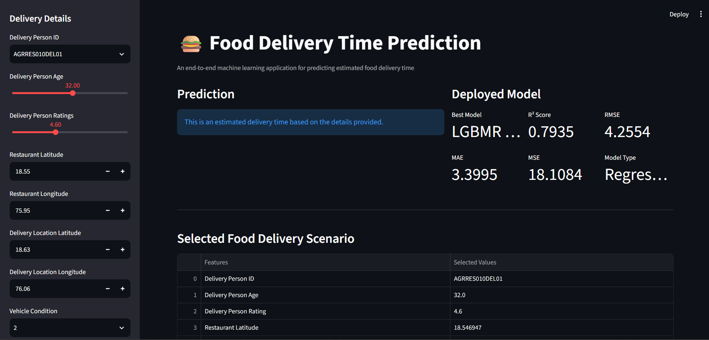
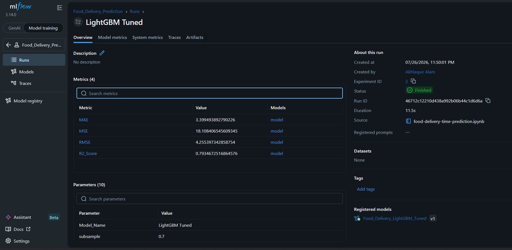

# 🍔 Food Delivery Time Prediction

### End-to-End Machine Learning Regression Project

A production-oriented Machine Learning project that predicts **food delivery time in minutes** using delivery-partner details, location, weather, traffic, vehicle condition, order information, and time-based features.

<p align="center">


</p>

<p align="center">

**45,593 Records  •  Regression  •  9 Models Compared  •  Tuned LightGBM  •  MLflow  •  Docker  •  Streamlit**

</p>

---

## Live Demo

<p align="center">

### [Open the Food Delivery Time Prediction App](https://akhlaque03-food-delivery-time-prediction.streamlit.app/)

</p>

The deployed application allows users to enter delivery, location, traffic, weather, vehicle, order, and timing information and receive an estimated delivery time.

---

## Project Preview

<p align="center">



</p>

---

## Project Overview

Food delivery time depends on multiple factors such as:

* Delivery-partner characteristics
* Restaurant and customer locations
* Weather conditions
* Road traffic
* Vehicle condition
* Order type
* Multiple deliveries
* Festival status
* City
* Order and pickup timing

The objective of this project is to build a regression model capable of estimating the expected delivery time in minutes and deploy it as an interactive web application.

### Project Pipeline

```text
Dataset
   ↓
Data Cleaning
   ↓
Exploratory Data Analysis
   ↓
Feature Engineering
   ↓
Data Preprocessing
   ↓
Baseline Model Training
   ↓
MLflow Experiment Tracking
   ↓
Hyperparameter Tuning
   ↓
Tuned Model Comparison
   ↓
Best Model Selection
   ↓
Model Persistence
   ↓
Streamlit Application
   ↓
Docker Containerization
   ↓
Cloud Deployment
```

---

## Business Problem

For food-delivery platforms, accurate delivery-time estimation can improve:

* Customer experience
* Estimated delivery-time accuracy
* Delivery operations
* Delivery-partner allocation
* Logistics planning
* Restaurant coordination

This project approaches the problem as a **supervised regression task**, where the model predicts delivery time in minutes from historical order information.

---

## Dataset

The dataset contains **45,593 food-delivery records** with numerical and categorical features.

### Target

```text
Time_taken(min)
```

The target represents the total delivery time in minutes.

### Main Features

| Feature                       | Description                 |
| ----------------------------- | --------------------------- |
| `Delivery_person_ID`          | Delivery partner identifier |
| `Delivery_person_Age`         | Delivery partner age        |
| `Delivery_person_Ratings`     | Delivery partner rating     |
| `Restaurant_latitude`         | Restaurant latitude         |
| `Restaurant_longitude`        | Restaurant longitude        |
| `Delivery_location_latitude`  | Customer latitude           |
| `Delivery_location_longitude` | Customer longitude          |
| `Order_Date`                  | Order date                  |
| `Time_Orderd`                 | Order placement time        |
| `Time_Order_picked`           | Order pickup time           |
| `Weatherconditions`           | Weather condition           |
| `Road_traffic_density`        | Traffic density             |
| `Vehicle_condition`           | Vehicle condition           |
| `Type_of_order`               | Food order type             |
| `Type_of_vehicle`             | Delivery vehicle            |
| `multiple_deliveries`         | Number of deliveries        |
| `Festival`                    | Festival indicator          |
| `City`                        | Delivery city               |

---

## Data Cleaning & Preprocessing

The raw dataset contained inconsistent values, missing values, mixed data types, and extreme numerical observations.

### Cleaning

* Removed the unnecessary `ID` column.
* Replaced invalid `NaN ` string values with actual missing values.
* Converted numerical columns into appropriate numeric types.
* Converted `Order_Date` into datetime format.
* Converted order and pickup times into datetime representations.
* Removed the original date/time columns after extracting useful information.

### Missing Values

| Data Type            | Treatment |
| -------------------- | --------- |
| Numerical features   | Median    |
| Categorical features | Mode      |

### Outlier Treatment

IQR-based clipping was applied to selected numerical features to reduce the influence of extreme observations while retaining the original records.

### Encoding

**Frequency Encoding**

```text
Delivery_person_ID
```

**One-Hot Encoding**

```text
Weatherconditions
Road_traffic_density
Type_of_order
Type_of_vehicle
Festival
City
```

### Scaling

Numerical features were scaled after encoding so that algorithms sensitive to feature magnitude could operate effectively.

---

## Feature Engineering

Date and time information was transformed into meaningful numerical features.

### Date Features

```text
Order_Day
Order_Month
Order_Day_of_Week
```

### Time Features

```text
Order_Hour
Order_Minute
Pickup_Hour
Pickup_Minute
```

This transformation allowed the models to capture temporal patterns affecting delivery time.

---

## Model Development

Nine regression algorithms were trained and evaluated.

### Models Compared

1. Linear Regression
2. KNN Regressor
3. SVM Regressor
4. Decision Tree Regressor
5. Random Forest Regressor
6. Gradient Boosting Regressor
7. XGBoost Regressor
8. LightGBM Regressor
9. CatBoost Regressor

The models were evaluated using:

* R² Score
* MAE
* MSE
* RMSE

---

## Baseline Model Performance

Before hyperparameter tuning, all nine models were compared using the same train-test split and evaluation metrics.

| Model             |       MAE |        MSE |      RMSE |  R² Score |
| ----------------- | --------: | ---------: | --------: | --------: |
| **CatBoost**      | **3.480** | **19.091** | **4.369** | **0.782** |
| XGBoost           |     3.515 |     19.517 |     4.418 |     0.777 |
| LightGBM          |     3.576 |     20.197 |     4.494 |     0.770 |
| Random Forest     |     3.745 |     23.198 |     4.816 |     0.735 |
| Gradient Boosting |     4.074 |     26.522 |     5.150 |     0.698 |
| Linear Regression |     4.993 |     40.017 |     6.326 |     0.544 |
| Decision Tree     |     4.901 |     43.285 |     6.579 |     0.506 |
| KNN Regressor     |     5.576 |     50.265 |     7.090 |     0.427 |
| SVM Regressor     |     5.571 |     50.404 |     7.100 |     0.425 |

### Baseline Comparison

<p align="center">


</p>

The baseline results showed that **CatBoost, XGBoost, and LightGBM** were the strongest candidates for further optimization.

---

## Hyperparameter Tuning

Based on the baseline results, hyperparameter tuning was performed on:

* LightGBM
* XGBoost
* CatBoost

`RandomizedSearchCV` with 5-fold cross-validation was used to explore different parameter combinations.

### LightGBM Tuning

The LightGBM search space included parameters such as:

```text
n_estimators
learning_rate
max_depth
num_leaves
min_child_samples
subsample
colsample_bytree
reg_alpha
reg_lambda
```

The final tuned LightGBM configuration included:

```python
LGBMRegressor(
    subsample=0.7,
    reg_lambda=5,
    reg_alpha=0.01,
    num_leaves=100,
    n_estimators=500,
    min_child_samples=30,
    max_depth=-1,
    learning_rate=0.05,
    colsample_bytree=0.7,
    random_state=42
)
```

---

## Tuned Model Comparison

After hyperparameter tuning, the three optimized boosting models were compared with their respective baseline versions.

| Model              |        MAE |         MSE |       RMSE |   R² Score |
| ------------------ | ---------: | ----------: | ---------: | ---------: |
| **LightGBM Tuned** | **3.3995** | **18.1084** | **4.2554** | **0.7935** |
| XGBoost Tuned      |     3.4394 |     18.6834 |     4.3224 |     0.7869 |
| CatBoost Tuned     |     3.4520 |     18.9816 |     4.3568 |     0.7835 |
| CatBoost           |     3.4801 |     19.0910 |     4.3693 |     0.7823 |
| XGBoost            |     3.5153 |     19.5171 |     4.4178 |     0.7774 |
| LightGBM           |     3.5760 |     20.1971 |     4.4941 |     0.7696 |

### Tuned Model Performance

<p align="center">


</p>

---

## Final Model

### LightGBM Tuned

The final deployment model is **Tuned LightGBM**, selected because it achieved the strongest performance among the tuned candidates.

### Final Performance

| Metric       |              Score |
| ------------ | -----------------: |
| **R² Score** |         **0.7935** |
| **MAE**      | **3.3995 minutes** |
| **RMSE**     | **4.2554 minutes** |
| **MSE**      |        **18.1084** |

The model explains approximately **79.35% of the variance** in delivery time on the evaluation data, with an average absolute prediction error of approximately **3.40 minutes**.

### Model Performance Snapshot

<p align="center">



</p>

---

## Feature Importance

The final LightGBM model was also analyzed to identify the features contributing most strongly to its predictions.

### Top Features

| Feature                       | Importance |
| ----------------------------- | ---------: |
| `Order_Day`                   |       4617 |
| `Delivery_location_latitude`  |       3844 |
| `Delivery_person_ID`          |       3652 |
| `Delivery_location_longitude` |       3387 |
| `Restaurant_longitude`        |       3381 |
| `Delivery_person_Age`         |       3375 |
| `Restaurant_latitude`         |       3258 |
| `Order_Hour`                  |       2954 |
| `Delivery_person_Ratings`     |       2515 |
| `Pickup_Hour`                 |       2362 |

These results highlight the importance of **temporal, geographical, and delivery-partner-related information** for estimating delivery time.

---

## MLflow Experiment Tracking

MLflow was integrated into the project to track Machine Learning experiments and maintain a structured record of model development.

### Tracked Information

* Model parameters
* Evaluation metrics
* Baseline experiments
* Tuned model experiments
* Model runs
* Final model performance

### Experiment

```text
Food_Delivery_Prediction
```

### MLflow Tracking

<p align="center">


</p>

MLflow helped make model comparison and experiment management more systematic and reproducible.

---

## Model Artifacts

The final application uses saved model and preprocessing artifacts.

| Artifact                           | Purpose                                        |
| ---------------------------------- | ---------------------------------------------- |
| `Food_Delivery_LightGBM_Tuned.pkl` | Final tuned LightGBM model                     |
| `feature_columns.pkl`              | Feature-column order required during inference |
| `freq_mappings.pkl`                | Frequency-encoding mappings                    |

Keeping these artifacts separate allows the deployed application to reproduce the same preprocessing structure used during model training.

---

## Streamlit Application

The trained model was integrated into an interactive Streamlit application.

### Application Features

* Delivery partner information
* Restaurant and customer location inputs
* Weather conditions
* Road traffic density
* Vehicle condition
* Order type
* Vehicle type
* Festival status
* City
* Order and pickup timing
* Estimated delivery-time prediction
* Final model performance metrics

### Prediction Interface

<p align="center">


</p>

The application displays the selected food-delivery scenario together with the predicted delivery time.

---

## Docker

The Streamlit application was containerized using Docker to provide a consistent runtime environment.

### Build Image

```bash
docker build -t food-delivery-app .
```

### Run Container

```bash
docker run -p 8501:8501 food-delivery-app
```

### Docker Container

<p align="center">


</p>

---

## Local Setup

### Clone Repository

```bash
git clone https://github.com/Akhlaque03/Food-Delivery-Time-Prediction.git
cd Food-Delivery-Time-Prediction
```

### Create Virtual Environment

```bash
python -m venv venv
```

### Activate Environment — Windows

```bash
venv\Scripts\activate
```

### Install Dependencies

```bash
pip install -r requirements.txt
```

### Run Streamlit

```bash
streamlit run app.py
```

---

## Run MLflow Locally

MLflow is used for experiment tracking and model evaluation.

```bash
mlflow ui --backend-store-uri sqlite:///mlflow.db
```

Then open:

```text
http://127.0.0.1:5000
```

> The local MLflow database is intentionally excluded from version control.

---

## Technology Stack

| Category            | Technologies                |
| ------------------- | --------------------------- |
| Language            | Python                      |
| Data Processing     | Pandas, NumPy               |
| Machine Learning    | Scikit-learn                |
| Boosting            | XGBoost, LightGBM, CatBoost |
| Visualization       | Matplotlib, Seaborn         |
| Experiment Tracking | MLflow                      |
| Web Application     | Streamlit                   |
| Containerization    | Docker                      |
| Deployment          | Streamlit Community Cloud   |
| Development         | Jupyter Notebook, VS Code   |

---

## Project Structure

```text
Food-Delivery-Time-Prediction/
│
├── app.py
├── train.csv
├── requirements.txt
├── runtime.txt
├── Dockerfile
│
├── Food_Delivery_LightGBM_Tuned.pkl
├── feature_columns.pkl
├── freq_mappings.pkl
│
├── README.md
│
└── screenshorts/
    ├── baseline_model_comparison.png
    ├── baseline_model_graph.png
    ├── tuned_model_comparison.png
    ├── tuned_model_graph.png
    ├── lightgbm_tuned_metrics.png
    ├── mlflow_experiment_tracking.png
    ├── home_page.png
    ├── prediction_result.png
    └── docker_container_running.png
```

---

## Key Results

### Model Development

* 9 regression algorithms evaluated.
* CatBoost achieved the strongest baseline R² score of **0.7823**.
* LightGBM, XGBoost, and CatBoost were selected for hyperparameter tuning.
* RandomizedSearchCV with 5-fold cross-validation was used for tuning.
* Tuned LightGBM achieved the best final performance.

### Final Model

```text
Model : Tuned LightGBM
R²    : 0.7935
MAE   : 3.3995 minutes
RMSE  : 4.2554 minutes
MSE   : 18.1084
```

### Deployment

```text
Model Training
      ↓
MLflow Tracking
      ↓
Hyperparameter Tuning
      ↓
Model Selection
      ↓
Model Persistence
      ↓
Streamlit Application
      ↓|
Docker
      ↓
Cloud Deployment
```

---

## Future Improvements

Potential next steps include:

* Real-time traffic and weather API integration
* Geospatial distance and route-based features
* SHAP-based model explainability
* Automated model retraining
* MLflow-based production monitoring
* CI/CD automation
* Cloud deployment on AWS, Azure, or Google Cloud
* Continuous model-performance monitoring

---

## Author

### Akhlaque Alam

**Aspiring Data Scientist | Machine Learning | Python | SQL | Streamlit | MLflow | Docker**

Focused on building practical Machine Learning projects that move beyond model training into **experiment tracking, model selection, application development, containerization, and deployment**.

<p align="center">

### [View Live Project](https://akhlaque03-food-delivery-time-prediction.streamlit.app/)

</p>
